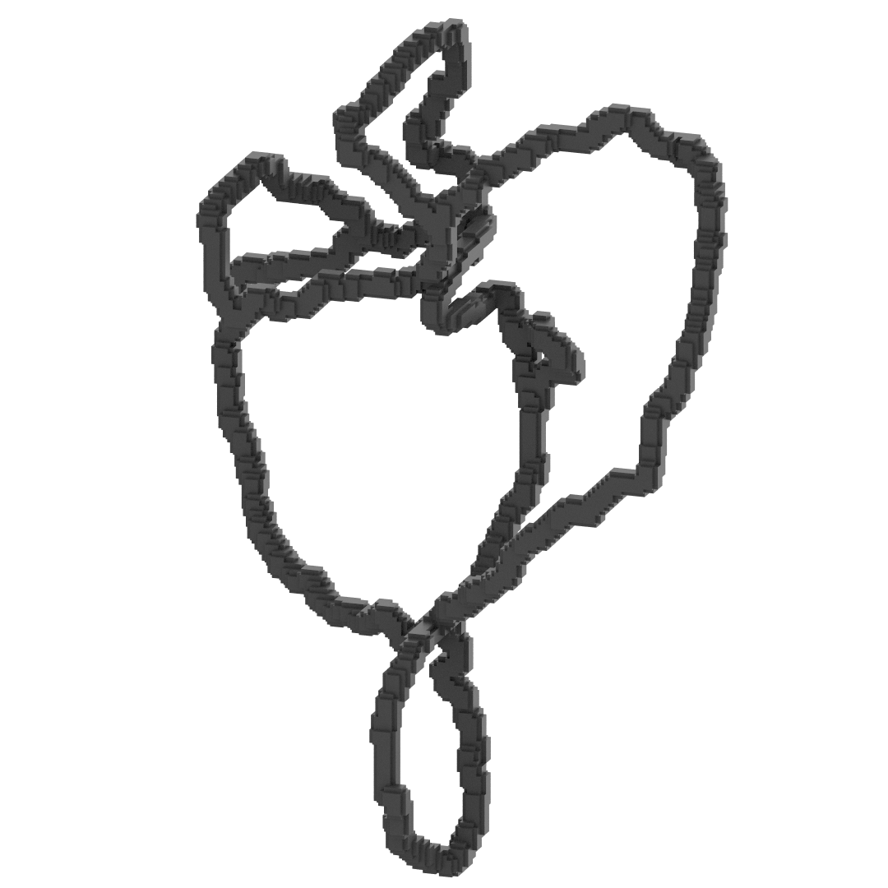
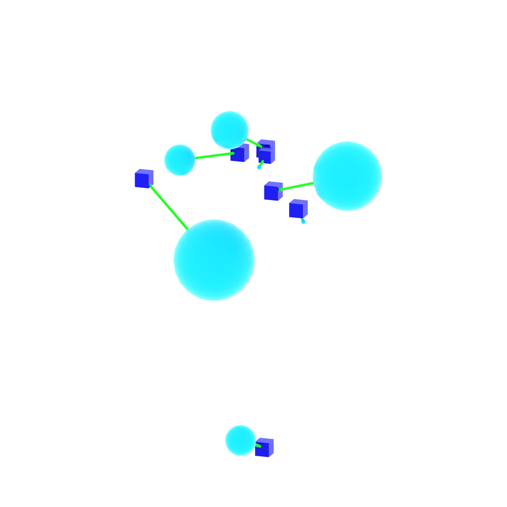
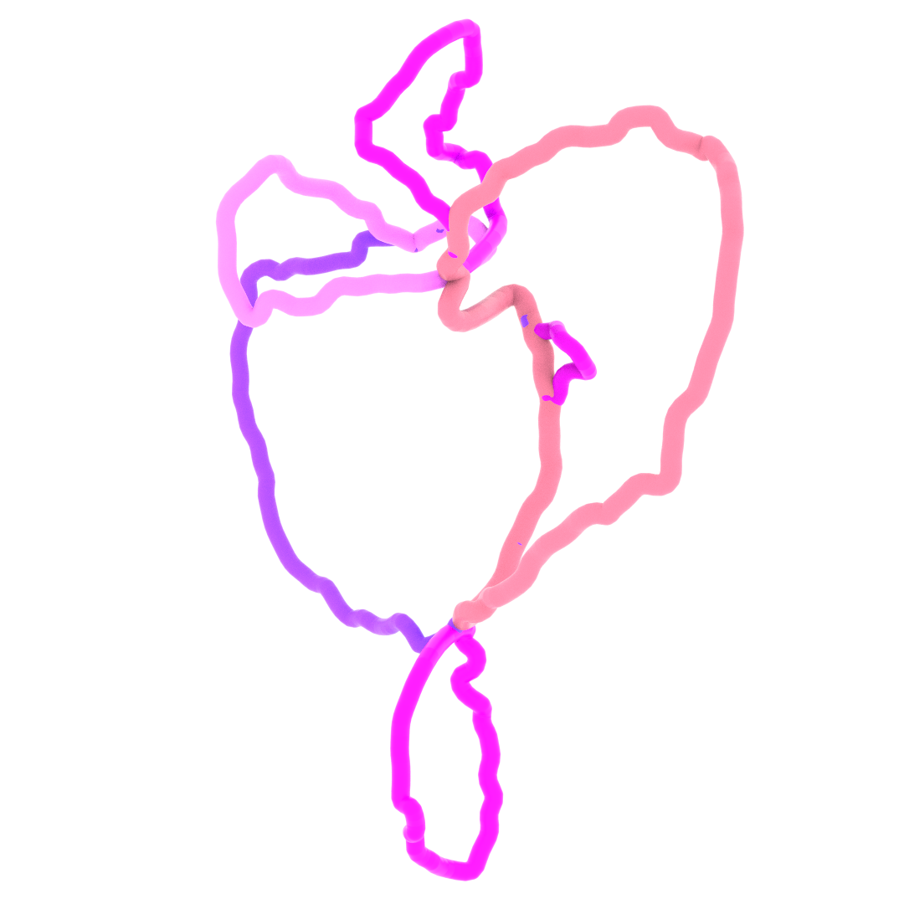
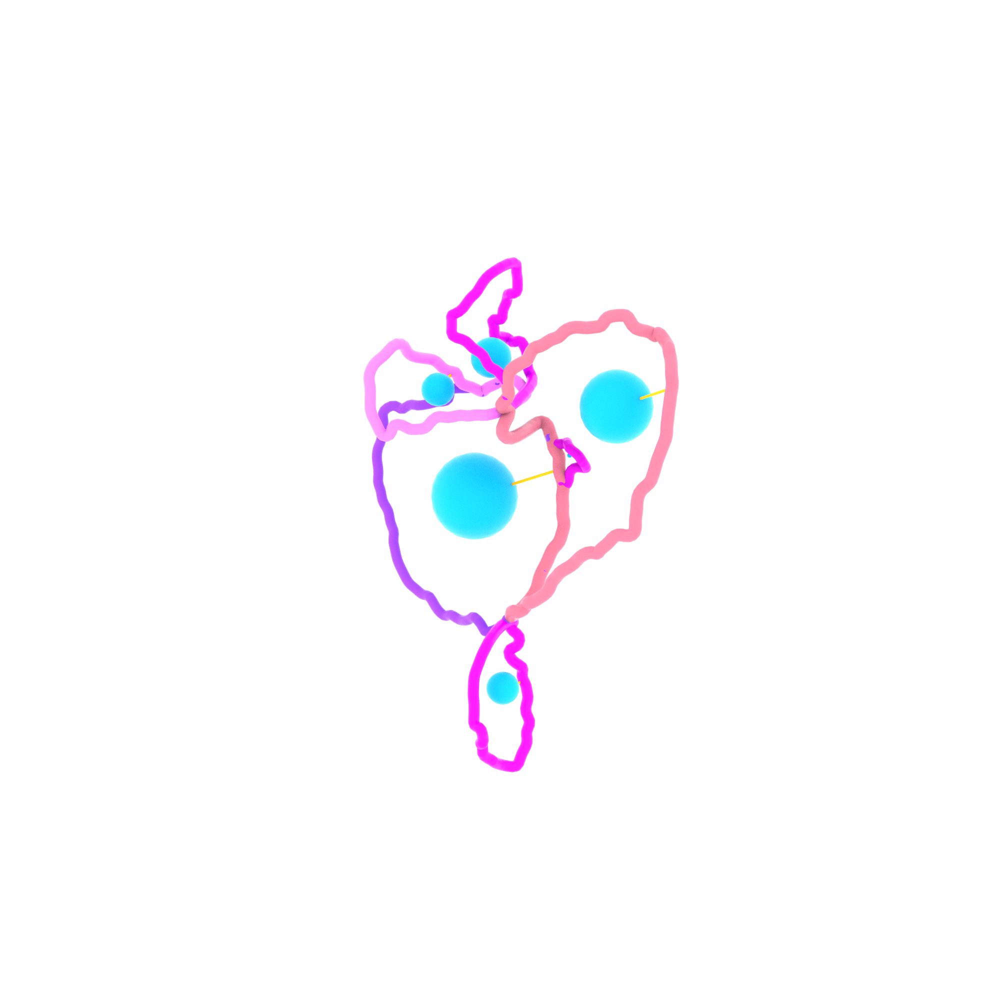

# Persistence Pair to Loop Cycle Matching

Matches persistence diagram birth/death pairs to geometric loop cycle representatives extracted from a minimum cycle basis of a network skeleton in 3D images.

This is the algorithm described in Section 1.2 of the Supporting Information of:

> **Topological Analysis of Multi-Network Architecture in the Pancreas**
> Raichenko, Maaruf, Nyeng, Evans (2026)
> https://www.biorxiv.org/content/10.64898/2026.03.02.708973v1

## Overview

The input is voxelised 3D data representing a network skeleton with loops:

<p align="center">
  
</p>

The corresponding persistence diagram contains birth/death pairs (cubes = birth points, spheres = death points, sphere size proportional to death value). The persistence pairs are pre-filtered to keep only those with death > 1.5, which correspond to real loops rather than noise:

<p align="center">
  
</p>

The geometric loops extracted from the minimum cycle basis of the skeleton are the candidates for matching:

<p align="center">
  
</p>

The algorithm pairs each persistence point to its corresponding geometric loop. The final matching is shown below, with death points (spheres) matched to their loops:

<p align="center">
  
</p>

## Algorithm

The algorithm proceeds in four stages:

1. **Candidate Harvesting**: For each persistence pair, candidate loops are collected via k-nearest neighbor search around the birth point and a radius search around the death point.

2. **Loop Scoring**: Each candidate is scored using spherical arc length (Omega), center distance, and minimum death distance.

3. **Primary Selection**: A hard constraint filters candidates, then the best is chosen by Omega qualification and center distance.

4. **Collision Resolution**: When multiple births map to the same loop, conflicts are resolved to ensure injectivity.

## Installation

```bash
pip install -r requirements.txt
```

Requires Python 3.8+ with numpy and scipy.

## Usage

```bash
python pairing.py
```

Inputs are hardcoded in `pairing.py`:
- **Cycles directory**: folder containing `net_cycle_*.poly` files
- **Persistence CSV**: `birth,death,x_b,y_b,z_b,x_d,y_d,z_d`

The persistence diagram is pre-filtered with death > 1.5 to select only pairs that correspond to real loops. The labeled volume and voxel-to-label mapping are built automatically from the `.poly` files at startup — no separate preparation step is needed.

## Example Data

- `cycles/` — input cycle `.poly` files (`net_cycle_<label>.poly`) representing geometric loops from a minimum cycle basis. These are the loops that get matched with persistence diagram pairs.
- `data/cycles_bd.csv` — pre-filtered persistence diagram (birth/death pairs with death > 1.5, corresponding to real loops)
- `data/dilated/all_cycles.poly` — all loop cycles combined into a single dilated point cloud (for visualization)

## Output

All outputs are saved to `pairing_results/`.

### `labeled_birth_loop_local.npy`

NumPy array where each row is:

| Column | Field | Description |
|--------|-------|-------------|
| 0 | bx | Birth point x coordinate |
| 1 | by | Birth point y coordinate |
| 2 | bz | Birth point z coordinate |
| 3 | label | Matched loop label (from `net_cycle_<label>.poly`), or -1 if unpaired |
| 4 | center_dist | Distance from loop barycenter to death point |
| 5 | dx | Death point x coordinate |
| 6 | dy | Death point y coordinate |
| 7 | dz | Death point z coordinate |
| 8 | birth_id | Row index from the input persistence CSV |

### `matching_vis.poly`

A visualization file for verifying the matching. Contains one edge per paired birth, connecting:
- The **death point** (red) to the **closest point on the matched loop** (green)

This can be loaded in any `.poly` viewer (e.g. Houdini) to visually inspect whether each persistence pair was matched to a sensible loop.

### Reports

- `decisions_all.txt` — per-birth decision report showing candidates and selection logic
- `collisions_report.txt` — collision resolution log

## Input Formats

### Persistence diagram CSV

```
birth,death,x_b,y_b,z_b,x_d,y_d,z_d
1.7,11.7,38.0,83.0,108.5,23.5,89.5,104.0
```

The `birth` and `death` columns are scalar persistence values. Columns `x_b,y_b,z_b` and `x_d,y_d,z_d` are the 3D coordinates of the birth and death critical points. Only pairs with death > 1.5 are used.

### Cycle `.poly` files

```
POINTS
1: 60 312 1510 c(0, 0, 0, 1)
2: 61 311 1511 c(0, 0, 0, 1)
...
POLYS
END
```

Each file `net_cycle_<label>.poly` contains the vertices of one geometric loop. The optional color field `c(...)` is ignored.

## Parameters

Key parameters can be modified at the top of `pairing.py`:

| Parameter | Value | Description |
|-----------|-------|-------------|
| K_NEAR_VOXELS | 768 | k-NN neighbors for birth-side harvest |
| MIN_CANDIDATES | 20 | Minimum candidate labels to harvest |
| SA_FLOOR | 5.0 rad | Spherical arc length qualification threshold |
| HARD_CONSTRAINT_EPS | 20 | Tolerance: md <= \|delta\| + epsilon |
| COLLISION_MOVE_MAX_CENTER_DELTA | 18.0 | Max center distance increase during collision moves |
| DEATH_RADIUS_PAD | 25 | Offset added to \|delta\| for death-side search radius |

## License

MIT
