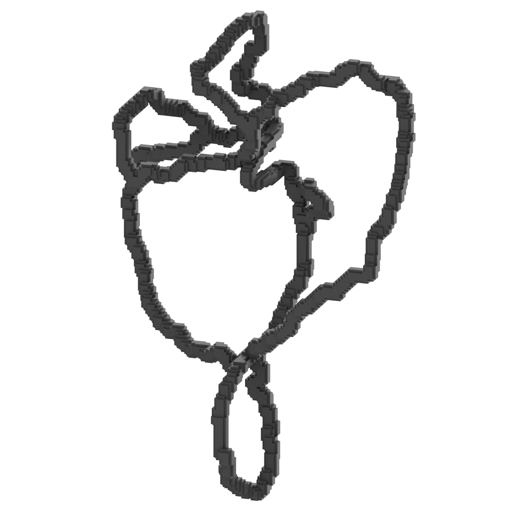
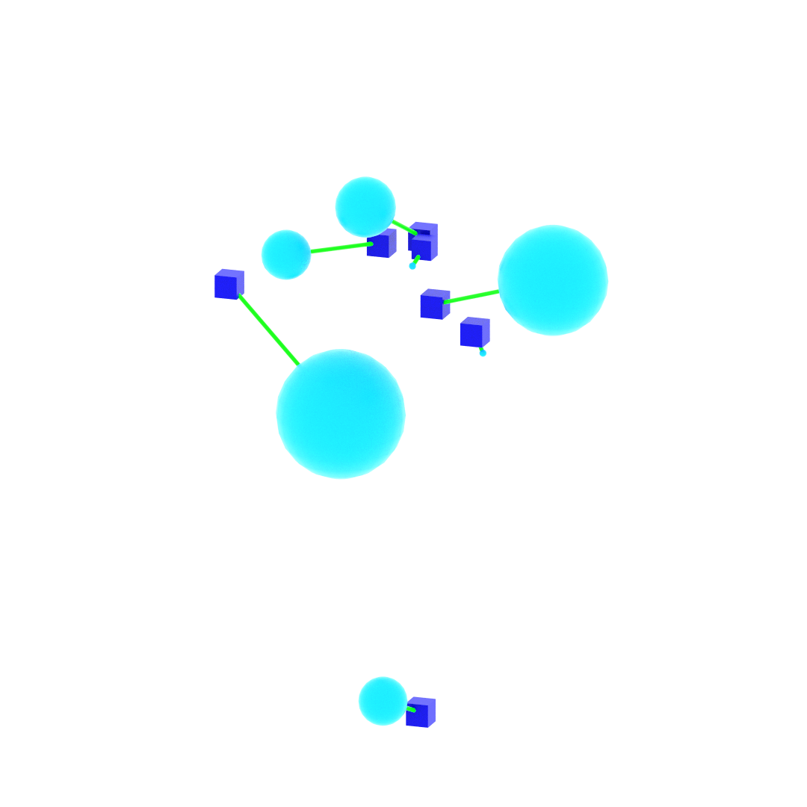
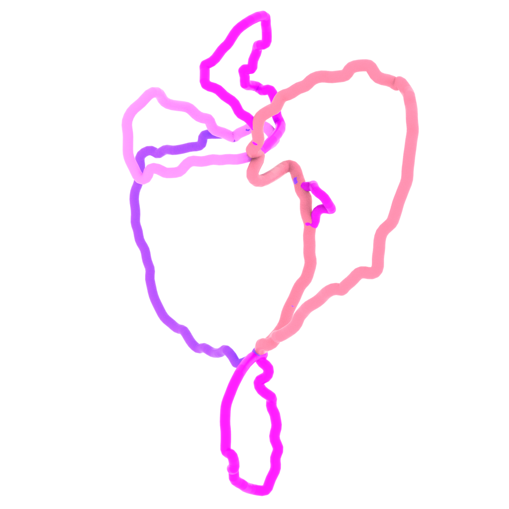
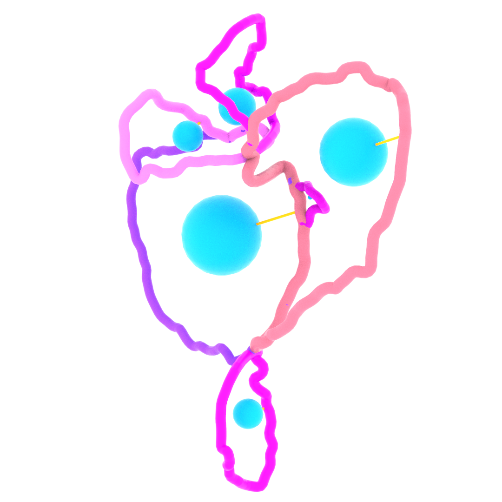

# Loop Basis Extraction, Pairing, Threading and Classification

[](https://doi.org/10.5281/zenodo.20759074)

Code for the loop-analysis pipeline used in:

> **Topological Analysis of Multi-Network Threading in the Pancreas**
> Raichenko, Maaruf, Nyeng, Evans (2026)
> https://www.biorxiv.org/content/10.64898/2026.03.02.708973v1

Given the **skeleton** of a network and its **persistence diagram**, this code
extracts the geometric loops of the network, pairs them with the persistence
birth/death points, and classifies each loop as *threaded* or *not threaded*
using the persistence information of the individual networks and their union.

## Overview

The pipeline runs in four stages:

```
skeletons + persistence diagrams
      │  1. basis extraction      (extract_basis.py)
      ▼
loop cycles  net_cycle_<i>.poly
      │  2. pairing               (pairing.py)
      ▼
birth → loop matching  labeled_birth_loop_local.npy
      │  3. threading separation  (separate_diagrams.py)
      ▼
threaded vs not-changed diagrams
      │  4. classification        (classify_loops.py)
      ▼
threaded / not-threaded loops + per-loop summary
```

1. **Basis extraction** — reads a network skeleton and computes a minimum cycle
   basis, i.e. the set of independent geometric loops of the network. Each loop
   is written to its own `.poly` file.
2. **Pairing** — matches every persistence birth/death pair to the loop it
   represents (see [the pairing details](#pairing-stage-details) below).
3. **Threading separation** — compares a single network's persistence diagram
   against the diagram of the **union** of two networks. A loop that exists in
   the single network but disappears in the union is *threaded* (it was
   destroyed by threading with the other network); a loop that survives is *not
   changed*.
4. **Classification** — labels each loop as *threaded* or *not threaded* and
   writes the loop geometry plus a per-loop summary (death value, length, class).

## Persistence diagrams (input)

The persistence diagrams are precomputed from the voxelised network images with
[**diamorse**](https://github.com/AppliedMathematicsANU/diamorse). For each
sample you need:

- one diagram **per individual network** (e.g. `C1_bd.csv`, `C2_bd.csv`), and
- one diagram for **the union of the two networks** (e.g. `C1_2_bd.csv`).

The union diagram is what stage 3 compares each single network against to decide
which loops are threaded.

## Installation

```bash
pip install -r requirements.txt
```

Requires Python 3.8+ with `numpy`, `scipy` and `networkx`.

## Usage

Place your inputs under a `networks/` folder:

```
networks/
  skeletons/              <name>_best.poly        one skeleton per network
  persistence_diagrams/   <name>_bd.csv           one diagram per network
                          C<i>_<j>_bd.csv          + the union diagram(s)
```

Run the whole pipeline:

```bash
python full_pipeline.py
```

or run any stage on its own:

```bash
python extract_basis.py
python pairing.py            --cycles-dir networks/cycles/C1 \
                             --persistence networks/persistence_diagrams/C1_bd.csv \
                             --results-dir networks/pairing_results/C1
python separate_diagrams.py
python classify_loops.py
```

## Output

All outputs are written back under `networks/`:

| Folder | Contents |
|--------|----------|
| `cycles/<name>/` | **All the loops** of the network — the minimum cycle basis. `net_cycle_<i>.poly` is one loop each, `all_cycles.poly` is every loop combined. |
| `pairing_results/<name>/` | The birth→loop matching (`labeled_birth_loop_local.npy`), a visualisation (`matching_vis.poly`) and decision/collision reports. |
| `threading/<name>/` | The persistence diagram split into threaded vs not-changed (`<name>_Hb/Hd/Hbd*.csv`). |
| `classified/<name>/` | **Classified loops** based on the persistence information: `Threaded_<name>.poly` and `Not_<name>.poly` (loop geometry coloured by label), the threaded/rest label lists, and `loops_summary_<name>.csv` (per loop: label, death value, length, representative death, class). |

## Input formats

### Skeleton `.poly`

```
POINTS
1: x y z c(...)
...
POLYS
1: a b
...
END
```

`POINTS` are the skeleton vertices; `POLYS` are edges between vertex indices.
The optional `c(...)` colour field is ignored.

### Persistence diagram CSV

```
birth,death,x_b,y_b,z_b,x_d,y_d,z_d
1.6,27.2,58.8,431.3,276.1,122.5,310.9,204.5
```

`birth`/`death` are the scalar persistence values; `x_b,y_b,z_b` and
`x_d,y_d,z_d` are the 3D coordinates of the birth and death critical points.

---

# Pairing stage details

The section below documents the **pairing** stage (`pairing.py`) on its own —
the algorithm it uses, the bundled standalone example, its output schema and its
parameters. It matches persistence diagram birth/death pairs to geometric loop
cycle representatives extracted from a minimum cycle basis of a network
skeleton, as described in Section 1.2 of the Supporting Information of the paper
cited above.

## Overview

The input is voxelised 3D data representing a network skeleton with loops:

<p align="center">
  
</p>

The corresponding persistence diagram contains birth/death pairs (cubes = birth points, spheres = death points, sphere size proportional to death value). The persistence pairs are pre-filtered to keep only those with death > 1.5, which correspond to real loops rather than noise:

<p align="center">
  
</p>

The geometric loops extracted from the minimum cycle basis of the skeleton are the candidates for matching:

<p align="center">
  
</p>

The algorithm pairs each persistence point to its corresponding geometric loop. The final matching is shown below, with death points (spheres) matched to their loops:

<p align="center">
  
</p>

In this example, one persistence point remains unpaired. This point originates from a cycle generated by the intersection of loops, which does not have a clean geometric representative among the input cycle files.

## Algorithm

The pairing algorithm proceeds in four stages:

1. **Candidate Harvesting**: For each persistence pair, candidate loops are collected via k-nearest neighbor search around the birth point and a radius search around the death point.

2. **Loop Scoring**: Each candidate is scored using spherical arc length (Omega), center distance, and minimum death distance.

3. **Primary Selection**: A hard constraint filters candidates, then the best is chosen by Omega qualification and center distance.

4. **Collision Resolution**: When multiple births map to the same loop, conflicts are resolved to ensure injectivity.

## Standalone example

`pairing.py` can be run on its own against the bundled example:

```bash
python pairing.py
```

- `cycles/` — input cycle `.poly` files (`net_cycle_<label>.poly`) representing geometric loops from a minimum cycle basis. These are the loops that get matched with persistence diagram pairs.
- `data/cycles_bd.csv` — pre-filtered persistence diagram (birth/death pairs with death > 1.5, corresponding to real loops)
- `data/dilated/all_cycles.poly` — all loop cycles combined into a single dilated point cloud (for visualization)

The labeled volume and voxel-to-label mapping are built automatically from the `.poly` files at startup — no separate preparation step is needed.

## Pairing output

Outputs are saved to the `--results-dir` (default `pairing_results/`).

### `labeled_birth_loop_local.npy`

NumPy array where each row is:

| Column | Field | Description |
|--------|-------|-------------|
| 0 | bx | Birth point x coordinate |
| 1 | by | Birth point y coordinate |
| 2 | bz | Birth point z coordinate |
| 3 | label | Matched loop label (from `net_cycle_<label>.poly`), or -1 if unpaired |
| 4 | center_dist | Distance from loop barycenter to death point |
| 5 | dx | Death point x coordinate |
| 6 | dy | Death point y coordinate |
| 7 | dz | Death point z coordinate |
| 8 | birth_id | Row index from the input persistence CSV |

### `matching_vis.poly`

A visualization file for verifying the matching. Contains one edge per paired birth, connecting:
- The **death point** (red) to the **closest point on the matched loop** (green)

This can be loaded in any `.poly` viewer (e.g. Houdini) to visually inspect whether each persistence pair was matched to a sensible loop.

### Reports

- `decisions_all.txt` — per-birth decision report showing candidates and selection logic
- `collisions_report.txt` — collision resolution log

## Cycle `.poly` files

```
POINTS
1: 60 312 1510 c(0, 0, 0, 1)
2: 61 311 1511 c(0, 0, 0, 1)
...
POLYS
END
```

Each file `net_cycle_<label>.poly` contains the vertices of one geometric loop. The optional color field `c(...)` is ignored.

## Pairing parameters

Key parameters can be modified at the top of `pairing.py`:

| Parameter | Value | Description |
|-----------|-------|-------------|
| K_NEAR_VOXELS | 768 | k-NN neighbors for birth-side harvest |
| MIN_CANDIDATES | 20 | Minimum candidate labels to harvest |
| SA_FLOOR | 5.0 rad | Spherical arc length qualification threshold |
| HARD_CONSTRAINT_EPS | 20 | Tolerance: md <= \|delta\| + epsilon |
| COLLISION_MOVE_MAX_CENTER_DELTA | 18.0 | Max center distance increase during collision moves |
| DEATH_RADIUS_PAD | 25 | Offset added to \|delta\| for death-side search radius |

## License

MIT